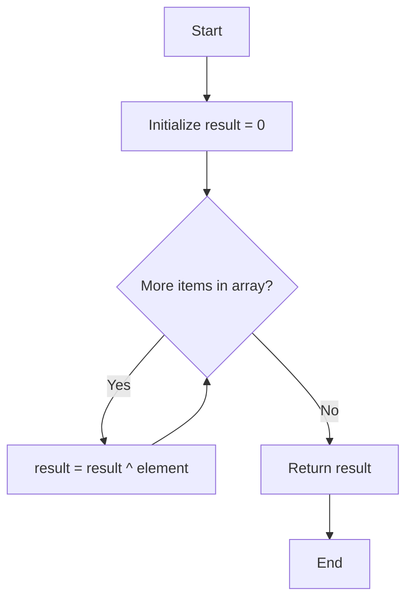

<div align="center">
  
  
  # [136. Single Number](https://leetcode.com/problems/single-number/)

  <p>
    
    
  </p>
</div>

---

## 📝 Problem Statement
Given a **non-empty** array of integers, every element appears twice except for one. Find that single one. You must implement a solution with a linear runtime complexity and use only constant extra space.

## 💡 Approach
We use **Bit Manipulation (XOR)** properties:
1. `X ^ X = 0` (XOR of a number with itself is `0`)
2. `X ^ 0 = X` (XOR of a number with `0` is the number itself)

Since all other elements appear exactly twice, their XOR will evaluate to `0`. The only element appearing once will be XORed with `0`, resulting in itself.

## 🔄 Flowchart


## 🧪 Pseudocode
```cpp
result = 0
for each number in nums:
    result = result XOR number
return result
```

## ⏱️ Complexity Analysis
- **Time Complexity**: **O(N)** - We iterate through the array exactly once, where N is the size of the array.
- **Space Complexity**: **O(1)** - We only use a single integer variable (`result`) to compute the answer.

## 🧠 Key Concepts
> - 
> - 
