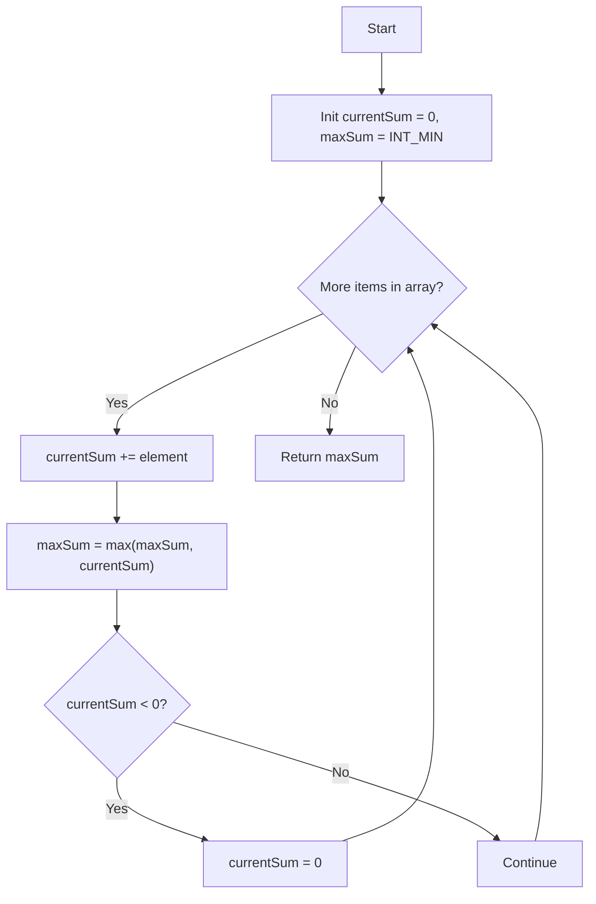

<div align="center">
  
  
  # [53. Maximum Subarray](https://leetcode.com/problems/maximum-subarray/)

  <p>
    
    
  </p>
</div>

---

## 📝 Problem Statement
Given an integer array `nums`, find the contiguous subarray (containing at least one number) which has the largest sum and return its sum.

## 💡 Approach
We use **Kadane’s Algorithm**:
- Keep track of a `currentSum` as we iterate through the elements.
- Continuously update the `maxSum` with the highest `currentSum` seen so far.
- If `currentSum` ever becomes negative, resetting it to `0` is optimal, because any negative sum would only decrease the sum of a future contiguous subarray.

## 🔄 Flowchart


## 🧪 Pseudocode
```cpp
currentSum = 0
maxSum = -infinity

for each number in nums:
    currentSum += number
    maxSum = max(maxSum, currentSum)

    if currentSum < 0:
        currentSum = 0

return maxSum
```

## ⏱️ Complexity Analysis
- **Time Complexity**: **O(N)** - We do a single pass through the array.
- **Space Complexity**: **O(1)** - Only two integer variables are used.

## 🧠 Key Concepts
> - 
> - 
