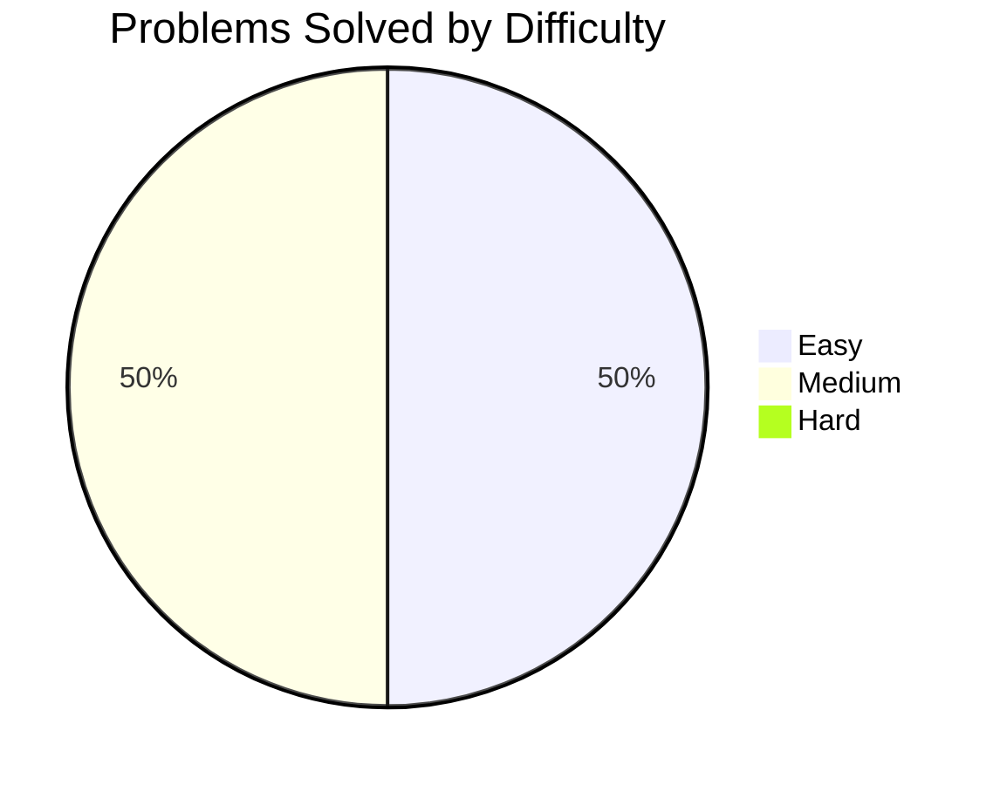

  
  
  # 🚀 C++ DSA & LeetCode Journey

  **Welcome to my LeetCode Data Structures and Algorithms tracking repository.**  
  *A personal vault for my problem-solving progress, optimized approaches, and conceptual learnings.*

  
  
  

---

## 📊 Progress Overview

Here is a visual breakdown of the problems solved so far based on difficulty.

---

## 📅 Activity Log & Tracker

**Tip for future updates:** Always add your newest problem to the **top** of the table below so you don't have to scroll down as the list grows!

| Date | Day | Problem | Difficulty | Approach / Concepts Used | Status |
| :---: | :---: | :--- | :---: | :--- | :---: |
| **Apr 03, 2026** | 02 | [53. Maximum Subarray](./Problem-53-Maximum-Subarray) |  | Kadane’s Algorithm, DP | ✅ |
| **Apr 02, 2026** | 01 | [136. Single Number](./Problem-136-Single-Number) |  | Bit Manipulation (XOR) | ✅ |

---

  <i>Happy Coding! Consistency is the key to mastering DSA.</i> 🚀

